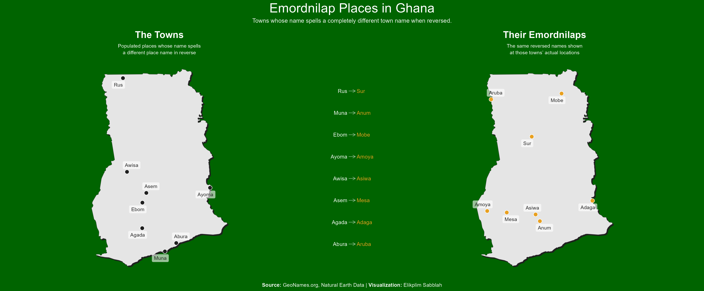

# Emordnilap Places in Ghana

A visualization of Ghanaian town names whose spelling reversed forms a completely different place name — known as **emordnilaps**.

## What is an Emordnilap?

An emordnilap is a word that spells a different valid word when reversed (e.g. *stressed* → *desserts*). This project applies that concept geographically — finding towns in Ghana whose names, when reversed, spell the name of another real place.

## Data

- Place name data: [GeoNames.org](https://www.geonames.org/)
- Country boundaries: [Natural Earth](https://www.naturalearthdata.com/)

## Visualization

**Source:** GeoNames.org, Natural Earth Data  
**Visualization:** Elikplim Sabblah
